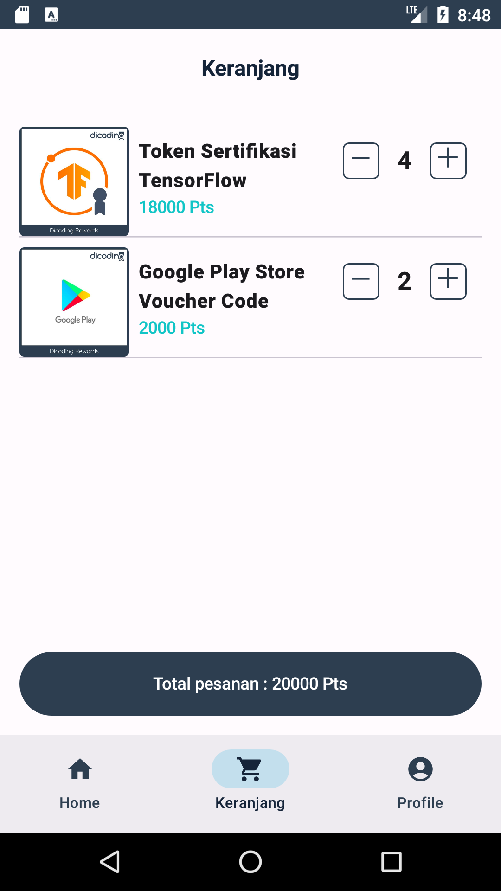

# Basic Layout Theory

This repository used for learning and testing:

| Project Name                 | Basic Layout Theory            |
|------------------------------|--------------------------------|
| Minimum Target SDK           | Phone and Tablet, API level 24 |
| Activity Type                | Jetpack Compose                | 
| Activity Name                | MainActivity                   |
| Language                     | Kotlin                         |
| Build Configuration Language | Kotlin DSL                     |

## 👀 Previews

This the output application after running the project:

    
    
    
    
    
    

