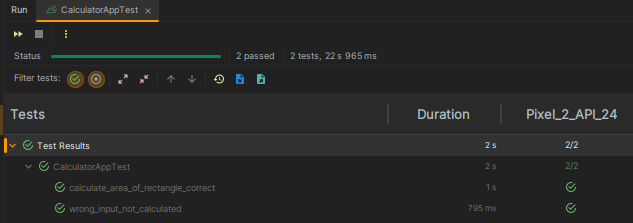

# MyComposeTesting

## 🔎 Overview

MyComposeTesting is a simple application demonstrating the basics of UI testing with Jetpack Compose. 
The application allows users to calculate the area of a rectangle by entering the length and width.

## 📢 Project Information

| Project Name                 | MyComposeTesting               |
|------------------------------|--------------------------------|
| Target & Minimum Target SDK  | Phone and Tablet, API level 24 |
| Activity Type                | Jetpack Compose                | 
| Activity Name                | MainActivity                   |
| Language                     | Kotlin                         |
| Build Configuration Language | Kotlin DSL                     |

## 🛠️ Features

- Jetpack Compose UI: Build and design a simple user interface.
- State Management: Use state variables to manage user input and results.
- UI Testing: Implement basic UI tests using Jetpack Compose Test.

## 👀 Previews

This the output application after running the project:

    
    

